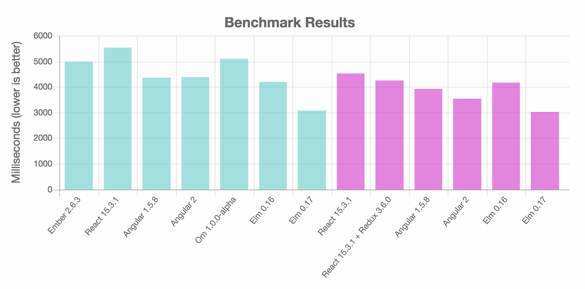
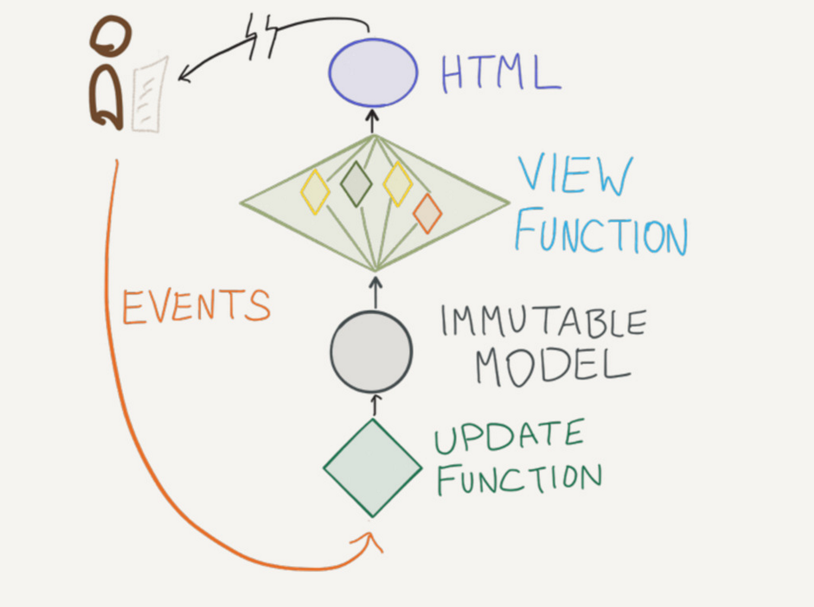
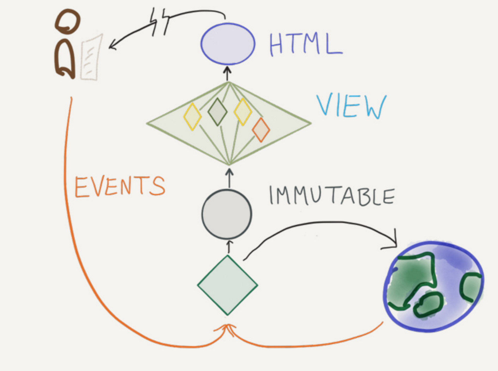

# Oficina de Elm
<hr />
<h4 class="subtitle">por Roberto Soares & Rogério Chaves</h4>


Note: apresentação

---

## Tópicos abordados

* Linguagem
* Arquitetura
* Tipos
* Erros
* Escalando

----

## Tópicos não abordados

* Interoperabilidade
* Testes
* CSS
* ...

---

## Elm?

----

## Linguagem Funcional

Esqueça o que escutou sobre funcional!

Note: esqueça: termos difíceis, idéias estranhas, ferramentas ruins

----

## Compila para JavaScript

Foco: Front-end

----

## Compilador como Assistente

Melhores mensagens de erro!

```sh
The branches of this `if` produce different types of values.

3|>  if n < 0 then
4|>  "erro!"
5|>  else
6|>  2

The `then` branch has type:

    String

But the `else` branch is:

    number

Hint: These need to match so that no matter which branch we take,
we always get back the same type of value.
```
<!-- .element: class="stretch" -->

----

## Rápido



<small>[Fonte](http://elm-lang.org/blog/blazing-fast-html-round-two)</small>

Note: esqueça: termos difíceis, idéias estranhas, ferramentas ruins

----

```elm
import Html exposing (Html, button, div, text)
import Html.App as App
import Html.Events exposing (onClick)

main =
  App.beginnerProgram { model = 0, view = view, update = update }

type Msg = Increment | Decrement

update msg model =
  case msg of
    Increment ->
      model + 1

    Decrement ->
      model - 1

view model =
  div []
    [ button [ onClick Decrement ] [ text "-" ]
    , div [] [ text (toString model) ]
    , button [ onClick Increment ] [ text "+" ]
    ]
```
<!-- .element: class="stretch" -->

Note: exemplo de código

---

## Mão na massa!

```sh
elm-repl
```

```elm
> "Hello World"
"Hello World" : String
```

```elm
> :exit
```

Alternativa Online: [bit.ly/elm-repl](http://bit.ly/elm-repl/)

Note: Read-eval-print-loop!

----

## Primitivos

```elm
> "hello" ++ "world"
"helloworld" : String
```

```elm
> (2 + 3) * 4
20 : number -- Int or Float depending on usage

> 9 / 2
4.5 : Float
```

```elm
> 'A'
'A' : Char
```

```elm
> True || False
True : Bool
```

----

## Funções

```elm
> positivo numero = numero > 0
```

```elm
> positivo -5
False
```

```elm
> positivo "a"
The argument to function `positivo` is causing a mismatch.
3|   positivo "a"
              ^^^
Function `positivo` is expecting the argument to be:
    number
But it is:
    String
```

----

## Listas

```elm
> names = [ "Alice", "Bob", "Chuck" ]
["Alice","Bob","Chuck"] : List String
```

```elm
> [1, "Mensagem"]
ERRORS!!!
```

```elm
> [True, False]
[True,False] : List Bool
```

----

## Tuplas

```elm
> (True, "yay!")
(True,"yay!") : ( Bool, String )
```

```elm
> (1,True,'a',[])
(1,True,'a',[]) : ( number, Bool, Char, List a )
```

----

## Records

```elm
> bill = { name = "Gates", age = 57 }
{ name = "Gates", age = 57 } : { age : number, name : String }
```

```elm
> bill.name
"Gates" : String

> .name bill
"Gates" : String
```

----

## Funções infix

```elm
> "hello" ++ "world"
> 3 + 5
```

```elm
> (+) 3 5
> (++) "hello" "world"
```

```elm
> soma = (+)
> 1 `soma` 2
```

---

## Nossa primeira aplicação

Editor Online: [elm-lang.org/try](http://elm-lang.org/try/)

---

## Hello World!

```elm
import Html exposing (Html, button, div, text)
import Html.App as App

main = App.beginnerProgram
    { model = 0
    , view = view
    , update = update
    }

update a = a

view model =
    text "hello world"
```

[bit.ly/oe-hello](http://bit.ly/oe-hello)

----

```elm
import Html exposing (Html, button, div, text)
import Html.App as App
```

Note: falar de import, exposing, App

----

```elm
main = App.beginnerProgram
    { model = 0
    , view = view
    , update = update
    }
```

Note: não aprofundar na arquitetura ainda. apenas
falar o que cada coisa representa e que vamos
definir logo após view e update.

----

```elm
update a = a
```

Note: atualiza o model/estado, porém no momento
apenas retorna o próprio estado. mais em breve

----

```elm
view model =
    text "hello world"
```

Note: renderiza o estado atual da aplicação

---

## Entradas de usuário: Botão

[bit.ly/oe-contador](http://bit.ly/oe-contador)

----

```elm
import Html.Events exposing (onClick)
```

----

```elm
type alias Model = Int
```

```elm
update : Msg -> Int -> Int

update : Msg -> Model -> Model
```

Note: falar de alias. leitura, refactoring

----

```elm
type Msg = Increment | Decrement
```

```elm
update : Msg -> Model -> Model
```

Note: falar de Union Types

----

```elm
update : Msg -> Model -> Model
update msg model =
  case msg of
    Increment ->
      model + 1

    Decrement ->
      model - 1
```

```elm
    button [ onClick Decrement ] [ text "-" ]
    button [ onClick Increment ] [ text "+" ]
```

Note: Union Types e estado novo

----

```elm
    button [ onClick Decrement ] [ text "-" ]
    button [ onClick Increment ] [ text "+" ]
```

```elm
    div [] [ text (toString model)
```

Note: apenas renderiza o estado atual

---

Pausa para falar da
## Arquitetura

----



---

## Entradas de usuário: Input

[bit.ly/oe-input](http://bit.ly/oe-input)

----

```elm
type Msg
    = Increment
    | Decrement
    | Change String
```

```elm
Increment
Change "100"
Change 4 -- invalid
```

Note: construtores

----

```elm
type Msg
    = Increment
    | Decrement
    | Change String
```

```elm
case msg of 
    Change strValue ->
        case (String.toInt strValue) of
```

Note: utilizando a String do Change String

----

```elm
case (String.toInt strValue) of
    Ok value ->
        value

    Err _ ->
        model
```

```elm
toInt : String -> Result String Int
```

```elm
type Result error value
    = Ok value
    | Err error
```

Note: exemplo de tratamento de erro, construtores.
falar do underscore

----

```elm
input [ value (toString model), onInput Change ] []
```

Note: na view muda pouca coisa

---

## Pegando Pokemons e Evoluindo

[bit.ly/oe-poke-imagens](http://bit.ly/oe-poke-imagens)

----

```elm
type alias Model =
    { name : String
    , image : String
    }
```

Note: model com mais dados

----

```elm
App.program
    { init = init
    , view = view
    , update = update
    , subscriptions = always Sub.none
    }
```

```elm
init : ( Model, Cmd Msg )

update : Msg -> Model -> ( Model, Cmd Msg )
```

Note: falar da mudança de assinatura e puxar o
próximo tópico, arquitetura

---

Pausa para falar da
## Arquitetura
novamente

----


---

## Nome do Bulba

[bit.ly/oe-poke-req](http://bit.ly/oe-poke-req)

----

```elm
button [ onClick GetPokemon ] [ text "Get more Pokémons!" ]
```

```elm
update : Msg -> Model -> ( Model, Cmd Msg )
update msg model =
    case msg of
        GetPokemon ->
            ( { model
                | name = "Loading..."
                , image = "http://www.pokestadium.com/assets/img/sprites/1.png"
              }
            , getPokemon 1
            )
```

```elm
getPokemon : Int -> Cmd Msg
```

Note: botão clicado -> mensagem -> retorna estado de loading + Cmd retornado
pela função getPokemon

----

```elm
Task.perform FetchFail FetchSucceed (Http.get decodePokemonName url)
```

```elm
type Msg
    = GetPokemon
    | FetchSucceed String
    | FetchFail Http.Error
```

Note: função getPokemon retorna uma task. falha, sucesso, tipos

----

```elm
FetchSucceed name ->
    ( { model
        | name = name
      }
    , Cmd.none
    )

FetchFail _ ->
    init
```

Note: resposta da request vira Msg e em caso de erro volta ao estado inicial

---

## Pokemons aleatórios

[bit.ly/oe-poke-random](http://bit.ly/oe-poke-random)

----

```elm
update msg model =
    case msg of
        GetRandomPokemon ->
            ( model, Random.generate FetchPokemon (Random.int 1 721) )

        FetchPokemon id ->
```

```elm
generate : (a -> msg) -> Generator a -> Cmd msg
```

Note: Random.generate retorna um Cmd. falar sobre aleatoridade em funcional

---

## Tempo

[bit.ly/oe-tempo](http://bit.ly/oe-tempo)

----

## Que lindo!

```elm
model.date
    |> toString
    |> text
```

```elm
model.date |> toString |> text
```

```elm
text(toString(model.date))
```

Note: lindo

----

### Subscriptions

```elm
subscriptions : Model -> Sub Msg
subscriptions _ =
    Time.every second Tick
```

```elm
type Msg
    = GetRandomPokemon
    | FetchPokemon Int
    | FetchSucceed String
    | FetchFail Http.Error
    | Tick Time
```

```elm
Tick time ->
    ( { model | date = fromTime time }, Cmd.none )
```

Note: falar de outros exemplos de subscriptions também
tem slide para ajudar a falar sobre

---

Pausa para falar da
## Arquitetura
pela última vez

----


----



Note: subscriptions!

---

## Criando seu Tipo

[bit.ly/oe-tipo](http://bit.ly/oe-tipo)

----

```elm
type alias Model =
    { name : String
    , image : String
    , date : Date
    }
```

```elm
type alias Model =
    { pokemon : Pokemon
    , date : Date
    }

type alias Pokemon =
    { name : String
    , image : String
    }
```

----

```elm
h2 [] [ text model.name ]
img [ src model.image ] []
```

```elm
pokemonView model.pokemon
```

```elm
pokemonView : Pokemon -> Html Msg
```


Note: falar das vantanges em criar seus próprios tipos

---

## That's all folks!

----

## Fontes

* [Guia Oficial](https://guide.elm-lang.org/)
* [Elixir e outras grandes ideias](https://speakerdeck.com/jessitron/elixir-and-other-great-ideas)

----

## Para aprender mais

* [Elm Tutorial](https://www.elm-tutorial.org/en/)
* [Elm in Action](https://www.manning.com/books/elm-in-action)
* [elm-conf](https://www.youtube.com/channel/UCOpGiN9AkczVjlpGDaBwQrQ)

----

# ¡Gracias!
